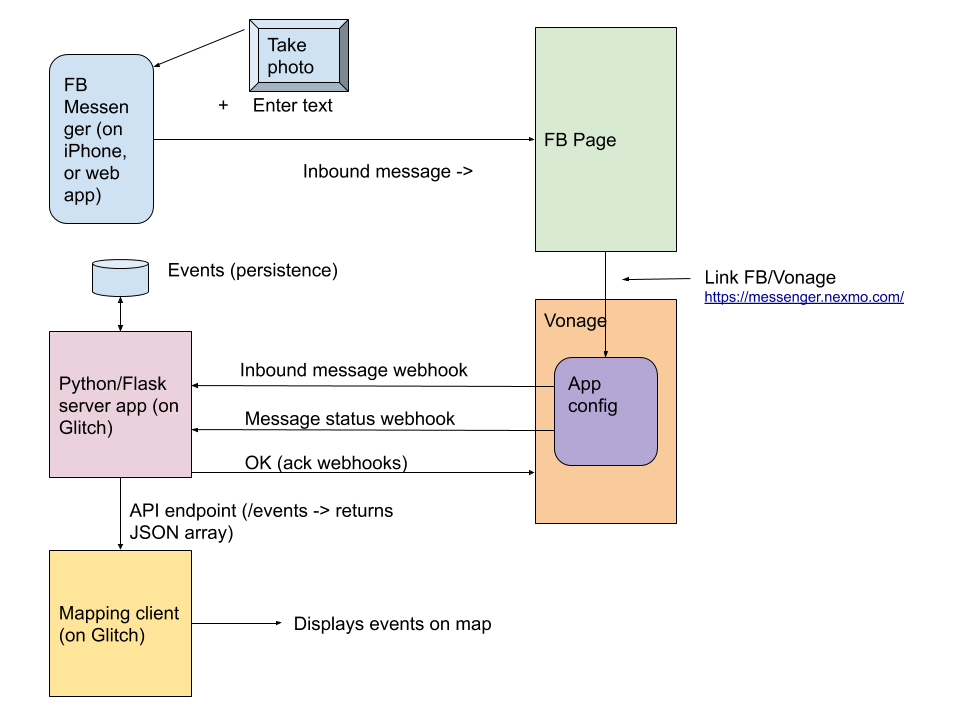

# FlySpy

Web app to plot environmental incidents on map.

The user sends a photo and some text via facebook Messenger. This represents a complete event, which is then pinned on a map with a preview of the image.

Created for Learn,Create, Share (LCS) between 4th - 6th August 2020.

## Overview

The following diagram provides an overview of the project:

## Server

The server folder contains these files:

* flyspy-flatfile.py
* flyspy-tinydb.py
* flyspy-tinydb-final.py

The first version implemented used a global array to store events. This provided proof of concept but after Glitch sleeps it will reload the code when it restarts, clearning memory.

`flyspy-flatfile.py` was then implemented and stored events in a text file. This worked fine but was not an ideal solution. 

`flyspy-tinydb.py` was an experiment with using TinyDB, a JSON database system. 

`flyspy-tinydb-final.py` is the final implementation for LCS, using TinyDB.

## Web app

The site is [live](https://ink-quilted-christmas.glitch.me/).

